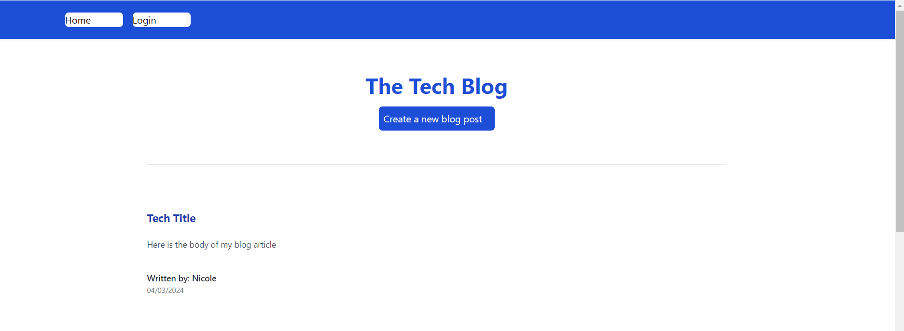

# Tech-Blog

## Overview 

This is a blog posting app where a user can see blog posts, or create an account to post their own blogs, and to see their own blogs on their dashboard. The site has full authentication, and a database to store and serve users, and blog posts.

## Built with

Built using Handlebars, MySQL2, SequelizeLinks, and Express.js. Tailwind was also used for styling features such as the log in page.

## Installation

Clone from GitHub repository, npm install.

## License

MIT (https://choosealicense.com/licenses/mit/)

## Project status & future development

I do not foresee future development on this. However, one item that was not included is the commenting on blog posts feature. This is something I definitely see value in learning and wish I had the time to include. 

GitHub repo: https://github.com/NicoleBrubaker/Tech-Blog

Deployed using Heroku: https://tech-blog-brubaker-45f0057a5197.herokuapp.com/

Home page of application:

